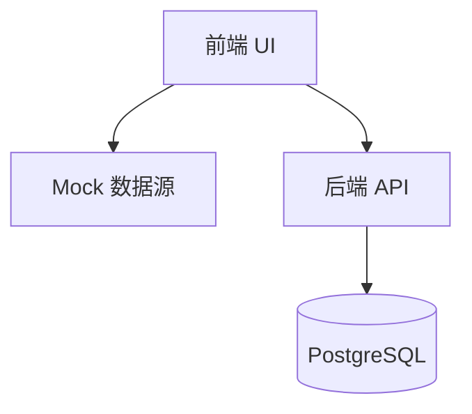

# 技术设计: 文档/Mock/布局/测试与联通方案

## 技术方案

### 核心技术
- 后端: FastAPI（内置 OpenAPI 文档）
- 前端: React + Ant Design + Vite
- Mock: vite-plugin-mock
- 测试: pytest

### 实现要点
- 文档输出为 docs/ 目录 Markdown，包含环境依赖、配置、启动、Mock、联通步骤
- 后端路由补充注释与说明（函数/入参/响应）
- 前端通过 vite-plugin-mock 实现数据 Mock，使用 .env 控制开关
- 页面布局改为 Top Header + Sider 二级导航
- 后端测试覆盖关键路径：锁定冲突、搜索分页、词典筛选、校验接口

## 架构设计

## 架构决策 ADR
### ADR-003: 前端 Mock 方案
**上下文:** 需要前端在无后端情况下自测
**决策:** 使用 vite-plugin-mock
**理由:** 社区普遍使用、与 Vite 兼容好、易于切换
**替代方案:** 本地假数据硬编码 → 拒绝原因: 可维护性差、切换困难
**影响:** 需维护 mock 数据与真实接口一致性

## API设计
- 保持现有 API，不新增接口
- 文档补充请求参数、响应结构与错误码说明

## 安全与性能
- Mock 仅限本地开发环境
- 保持配置项显式声明，缺失直接报错

## 测试与部署
- 后端使用 pytest 执行单元测试
- 前端 mock 使用 Vite 启动进行页面验证
