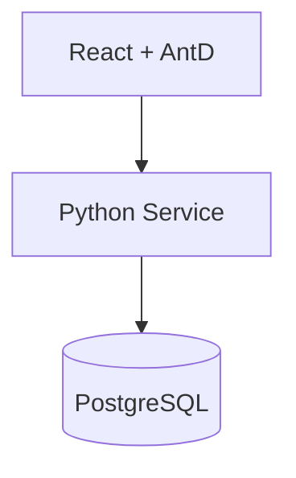

# 技术设计: LOTRO 文本汉化系统 MVP

## 技术方案
### 核心技术
- 后端：Python（框架待定）
- 前端：React + Ant Design
- 数据：PostgreSQL

### 实现要点
- 主文本与认领、锁定、变更历史分表，减少热表争用
- 列表筛选与关键词搜索使用索引优化（fid/part/status + 文本检索索引）
- 翻译页锁定采用“单活锁”+过期时间，避免并发编辑
- 词典高亮与数量一致性提示在翻译页实时计算

## 架构设计


## 架构决策 ADR
### ADR-001: 单体 MVP + PostgreSQL 索引优化
**上下文:** 文本量巨大、需要快速交付核心协作流程
**决策:** 先采用单体后端 + PostgreSQL 索引与分表设计满足性能需求
**理由:** 实施成本低、可快速迭代、对锁定与检索可控
**替代方案:** 分布式锁/搜索服务 → 拒绝原因: 复杂度高、交付成本大
**影响:** 后续如性能瓶颈再引入搜索服务或拆分

## API设计
### [POST] /auth/login
- **请求:** { username, password }
- **响应:** { user, roles }

### [GET] /texts
- **请求:** { fid, part, assignee, status, source_kw, trans_kw, page, page_size }
- **响应:** { items, total }

### [GET] /texts/{id}
- **请求:** {}
- **响应:** { text, claims, lock, last_changes }

### [POST] /claims
- **请求:** { text_id }
- **响应:** { claim_id }

### [POST] /locks
- **请求:** { text_id }
- **响应:** { lock_id, expires_at }

### [DELETE] /locks/{id}
- **请求:** {}
- **响应:** { ok }

### [GET] /changes?text_id=...
- **请求:** {}
- **响应:** { items }

### [POST] /translate
- **请求:** { text_id, translated_text, reason }
- **响应:** { ok, edit_count }

### [GET] /dictionary
- **请求:** { keyword, page, page_size }
- **响应:** { items, total }

### [POST] /validate
- **请求:** { text_id, translated_text }
- **响应:** { ok, errors }

## 数据模型
```sql
-- 可选：用于关键词模糊检索
CREATE EXTENSION IF NOT EXISTS pg_trgm;

CREATE TABLE users (
  id BIGSERIAL PRIMARY KEY,
  username VARCHAR(64) NOT NULL UNIQUE,
  password_hash VARCHAR(128) NOT NULL,
  password_salt VARCHAR(64) NOT NULL,
  is_guest BOOLEAN NOT NULL DEFAULT FALSE,
  created_at TIMESTAMP NOT NULL DEFAULT NOW(),
  updated_at TIMESTAMP NOT NULL DEFAULT NOW()
);

CREATE TABLE roles (
  id BIGSERIAL PRIMARY KEY,
  name VARCHAR(32) NOT NULL UNIQUE,
  description VARCHAR(128)
);

CREATE TABLE user_roles (
  user_id BIGINT NOT NULL REFERENCES users(id),
  role_id BIGINT NOT NULL REFERENCES roles(id),
  PRIMARY KEY (user_id, role_id)
);

CREATE TABLE permissions (
  id BIGSERIAL PRIMARY KEY,
  perm_key VARCHAR(64) NOT NULL UNIQUE,
  description VARCHAR(128)
);

CREATE TABLE role_permissions (
  role_id BIGINT NOT NULL REFERENCES roles(id),
  perm_id BIGINT NOT NULL REFERENCES permissions(id),
  PRIMARY KEY (role_id, perm_id)
);

CREATE TABLE text_main (
  id BIGSERIAL PRIMARY KEY,
  fid VARCHAR(64) NOT NULL,
  part VARCHAR(64) NOT NULL,
  source_text TEXT NOT NULL,
  translated_text TEXT,
  status VARCHAR(16) NOT NULL DEFAULT '待认领',
  edit_count INT NOT NULL DEFAULT 1,
  updated_at TIMESTAMP NOT NULL DEFAULT NOW(),
  created_at TIMESTAMP NOT NULL DEFAULT NOW()
);

CREATE UNIQUE INDEX uq_text_main_fid_part ON text_main(fid, part);
CREATE INDEX idx_text_main_status ON text_main(status);
CREATE INDEX idx_text_main_updated_at ON text_main(updated_at DESC);
-- 关键词检索索引（极为重要）
CREATE INDEX idx_text_main_source_trgm ON text_main USING GIN (source_text gin_trgm_ops);
CREATE INDEX idx_text_main_trans_trgm ON text_main USING GIN (translated_text gin_trgm_ops);

CREATE TABLE text_claims (
  id BIGSERIAL PRIMARY KEY,
  text_id BIGINT NOT NULL REFERENCES text_main(id),
  user_id BIGINT NOT NULL REFERENCES users(id),
  claimed_at TIMESTAMP NOT NULL DEFAULT NOW(),
  UNIQUE (text_id, user_id)
);
CREATE INDEX idx_text_claims_text_id ON text_claims(text_id);
CREATE INDEX idx_text_claims_user_id ON text_claims(user_id);

CREATE TABLE text_locks (
  id BIGSERIAL PRIMARY KEY,
  text_id BIGINT NOT NULL REFERENCES text_main(id),
  user_id BIGINT NOT NULL REFERENCES users(id),
  locked_at TIMESTAMP NOT NULL DEFAULT NOW(),
  expires_at TIMESTAMP NOT NULL,
  released_at TIMESTAMP
);
-- 单活锁: 同一文本只能存在一条未释放锁
CREATE UNIQUE INDEX uq_text_locks_active ON text_locks(text_id) WHERE released_at IS NULL;
CREATE INDEX idx_text_locks_user_id ON text_locks(user_id);

CREATE TABLE text_changes (
  id BIGSERIAL PRIMARY KEY,
  text_id BIGINT NOT NULL REFERENCES text_main(id),
  user_id BIGINT NOT NULL REFERENCES users(id),
  before_text TEXT NOT NULL,
  after_text TEXT NOT NULL,
  reason VARCHAR(255),
  changed_at TIMESTAMP NOT NULL DEFAULT NOW()
);
CREATE INDEX idx_text_changes_text_id ON text_changes(text_id);
CREATE INDEX idx_text_changes_changed_at ON text_changes(changed_at DESC);

CREATE TABLE dictionary_entries (
  id BIGSERIAL PRIMARY KEY,
  term_key VARCHAR(128) NOT NULL,
  term_value VARCHAR(128) NOT NULL,
  category VARCHAR(64),
  is_active BOOLEAN NOT NULL DEFAULT TRUE,
  created_at TIMESTAMP NOT NULL DEFAULT NOW(),
  updated_at TIMESTAMP NOT NULL DEFAULT NOW()
);
CREATE INDEX idx_dictionary_key ON dictionary_entries(term_key);
CREATE INDEX idx_dictionary_value ON dictionary_entries(term_value);
```

## 安全与性能
- **安全:** 加盐 MD5（MVP 可用），登录限速与失败次数保护；游客权限最小化
- **性能:** 列表筛选使用组合索引，关键词检索用 GIN+pg_trgm；分页使用游标或 offset+limit

## 测试与部署
- **测试:** 锁定冲突、关键词检索、词典数量提示、变更历史写入
- **部署:** 先内网环境验证，再灰度上线
