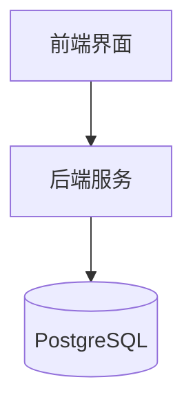
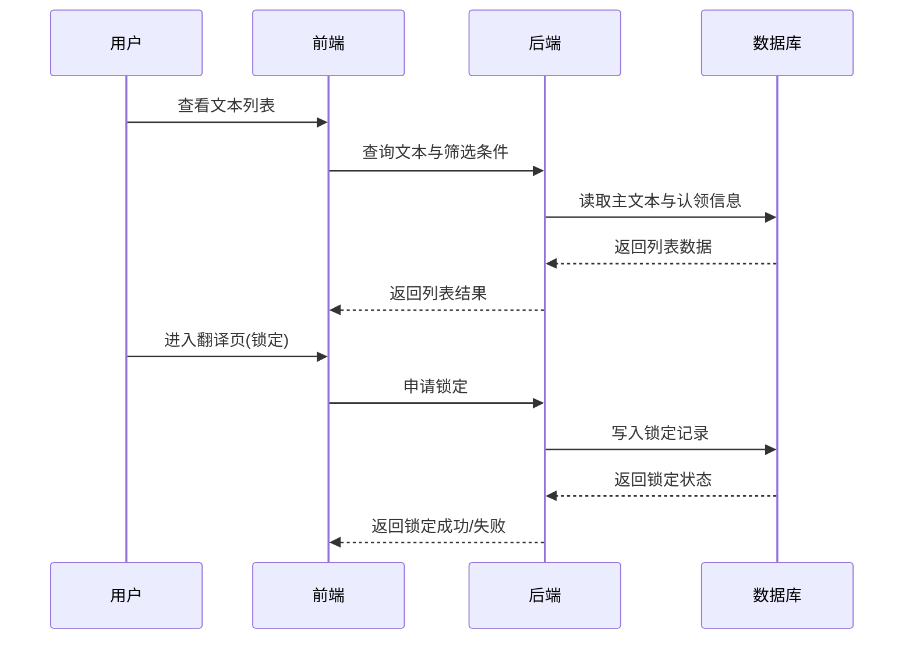

# 架构设计

## 总体架构

## 技术栈
- **后端:** Python（框架待定）
- **前端:** React + Ant Design
- **数据:** PostgreSQL

## 核心流程

## 重大架构决策
完整的ADR存储在各变更的how.md中，本章节提供索引。

| adr_id | title | date | status | affected_modules | details |
|--------|-------|------|--------|------------------|---------|
| ADR-001 | 初始架构与数据模型方案 | 2026-01-30 | ✅已采纳 | 用户与权限、文本任务与翻译、词典管理、文本校验 | 待方案包生成 |
